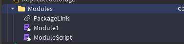
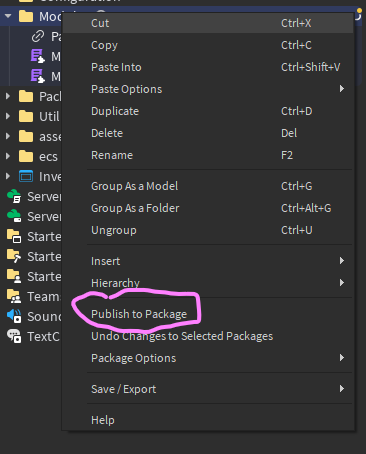
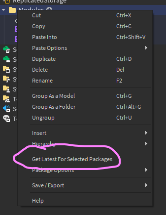

# 📦 What are Packages?

Packages in Roblox let us share folders across different branches and workspaces. If you change something inside a package and **publish it**, anyone else can **sync** those changes into their own workspace automatically!

This is **super important** for our workflow at Dress to Impress, where everyone works in their own private branch (like their own copy of the game). Without packages, people would constantly overwrite each other’s work. Packages solve that.

---

## 🧠 Why We Use Packages

Here’s a real-world DTI example:

- Nick updates a script inside the `Modules` folder in his own branch.
- Kyle is working on something else in **his** branch, but still needs Nick's updated code.
- Because `Modules` is a shared **package**, Kyle can just **sync** and get the changes automatically!

No more copy/pasting. No more overwriting each other’s work. ✅

---

## 📁 Folder Structure: Where Are Packages Stored?

All shared content is stored in folders under `ReplicatedStorage.Assets`, and many of these are **packages**.

```
ReplicatedStorage
└── Assets (📦 Package)
    ├── Modules (📦 Package)
    ├── UI (📦 Package)
    └── Models (📦 Package)
```

Each of these folders is a **package**. If you change anything inside, it will become “out of sync” until you **publish** it.

---

## 🗂 Example: Modules Package

Here’s what a typical **Modules** package looks like inside Roblox Studio:



> This is a shared folder that contains Lua modules used in multiple places across the game.  
> Any time someone changes a script inside it and **publishes** it, others can **pull** the update.

---

## 🟡 What Happens When You Edit a Package?

When you make a change inside a package folder, you'll see this icon:

- ⚠️ Yellow box = **Out of sync**
- 🔄 Why? You made a local change that hasn't been published yet

If others don’t have your changes, their version will become **outdated**. That's why you must always **publish** after you're done editing shared code/assets.

---

## 🚀 Step-by-Step: Publishing a Package

If you made a change to a shared asset (like a UI element, model, or script), you’ll want to **publish** the package so others can get it.

### ✅ Example
> Nick edits a script inside `Modules` to fix inventory syncing.  
> When he’s done, he publishes the package so everyone else can update.

**How to publish:**

1. Right-click the package folder in the Explorer  
2. Click `Publish to Package` → `Publish`



> This uploads your version of the folder so everyone else can sync it.

---

## 🔄 Step-by-Step: Syncing a Package

If someone else made changes to a shared package, you’ll want to **sync** to get their new version.

### ✅ Example
> Kyle is working in his own branch. He sees that `Modules` is out of sync, and Nick already published changes.  
> Kyle syncs the package and instantly gets the updated code.

**How to sync:**

1. Right-click the package folder in your Explorer  
2. Click `Get Latest for Selected Packages` → `Get Latest`



> This pulls down the latest version that was published by your teammates.

---

## 📌 Summary

- **Packages** are folders shared across branches
- You can **publish** your changes so others can get them
- You can **sync** to stay up to date with everyone else
- Used for: `Scripts`, `UI Assets`, `3D Models`, etc.
- Keeps everyone in sync and avoids reintroducing bugs

---

## 📚 Learn More

- 📖 Official Roblox Docs: [Using Packages](https://create.roblox.com/docs/projects/assets/packages)
- 🧠 See how we use packages in practice: [DTI Workflow](Workflow.md)

---

Keep things in sync. Use packages!!
